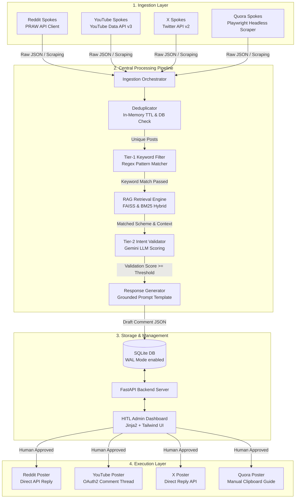

# 🚀 Lead-Gen Pipeline for Social Media (HITL)

An autonomous social media listening, intent validation, and grounded response generation pipeline. The system monitors popular platforms (Reddit, YouTube, X, and Quora), processes ingested posts through a rigorous filtering and validation system, matches leads to relevant banking products using RAG, and generates human-like response drafts. Everything is managed via a visual **Human-in-the-Loop (HITL) Admin Dashboard** where drafts can be reviewed, edited, approved, and automatically posted.

---

## 🗺️ Architectural Flow

The diagram below details the entire data lifecycle, from dynamic ingestion spokes through pipeline filtering, RAG retrieval, LLM validation, human approval, and final throttled posting execution.



---

## 🛠️ System Requirements & Installation

### Prerequisite Dependencies
- Python **3.9 to 3.11** (recommended)
- Node.js (only for installing Playwright system dependencies, if required)
- Git

### Installation Steps

1. **Clone the Repository**
   ```bash
   git clone https://github.com/wrathog12/Lead-Gen-Pipeline-For-Social-Media.git
   cd Lead-Gen-Pipeline-For-Social-Media
   ```

2. **Establish a Virtual Environment**
   ```bash
   python -m venv venv
   # Activate on Windows:
   venv\Scripts\activate
   # Activate on Linux/macOS:
   source venv/bin/activate
   ```

3. **Install Core Requirements**
   ```bash
   pip install -r requirements.txt
   ```

4. **Initialize Playwright Dependencies**
   Quora scraping uses headless browser automation. Ensure the underlying browser runtimes are installed:
   ```bash
   playwright install chromium
   ```

5. **Generate Database & Sample Data**
   The application uses SQLite as its persistent database engine. Initialize and seed the DB with 50+ high-fidelity simulated posts, drafts, and pipeline logs across all platforms:
   ```bash
   python seed_data.py
   ```
   *Note: This creates a pre-populated SQLite database at `data/leadgen.db` with WAL mode enabled.*

6. **Fire Up the Backend Server**
   ```bash
   uvicorn api.server:app --host 127.0.0.1 --port 8000 --reload
   ```
   Once started, access the Admin Dashboard at: **[http://127.0.0.1:8000/](http://127.0.0.1:8000/)**

---

## 🔑 Environment Variables Setup (`.env`)

To activate the automated ingestion and posting agents, configure your environment tokens. Copy the configuration template:
```bash
copy .env.example .env
```
Open the newly created `.env` file and populate the keys described below.

> [!CAUTION]
> Never commit your `.env` file to source control. It contains highly sensitive credentials and is explicitly ignored in `.gitignore`.

---

### 1. Gemini AI API Key
Used for Tier-2 Intent Validation (evaluating customer query urgency/seriousness) and Response Generation (synthesizing professional, compliance-friendly replies grounded on RAG documents).

* **Variable**: `GEMINI_API_KEY`
* **How to obtain**:
  1. Navigate to [Google AI Studio](https://aistudio.google.com/).
  2. Log in with your Google account.
  3. Click **Get API Key** and generate a new key.
  4. Copy-paste the raw string (starts with `AIzaSy...`).

---

### 2. Reddit API (PRAW) Setup
Used to fetch recent posts from financial subreddits (e.g., `r/personalfinanceindia`) and post approved comments directly.

* **Variables**:
  - `REDDIT_CLIENT_ID`
  - `REDDIT_CLIENT_SECRET`
  - `REDDIT_USERNAME`
  - `REDDIT_PASSWORD`
  - `REDDIT_USER_AGENT`
* **How to obtain**:
  1. Visit the [Reddit App Preferences](https://www.reddit.com/prefs/apps).
  2. Scroll to the bottom and click **Create App** / **Create Another App**.
  3. Fill out the fields:
     - **Name**: `Lead-Gen-Pipeline-PoC`
     - **App Type**: Select **script** (Critical!)
     - **Redirect URI**: Set to `http://localhost:8080` (or any valid local URL).
  4. Create the app. 
  5. The **Client ID** is the 14-character string located directly underneath your app name/logo.
  6. The **Client Secret** is listed inside the application details as `secret`.
  7. Fill in your Reddit Account credentials (`REDDIT_USERNAME` and `REDDIT_PASSWORD`).
  8. For `REDDIT_USER_AGENT`, use a unique identifier string, e.g., `LeadGenAgent/0.1 by u/your_username`.

---

### 3. YouTube API & OAuth Credentials
YouTube ingestion requires a standard API key, while automated posting requires a user-delegated OAuth Access Token.

* **Variables**:
  - `YOUTUBE_API_KEY`
  - `YOUTUBE_OAUTH_TOKEN`

#### Part A: Generating the `YOUTUBE_API_KEY` (For Ingestion)
1. Go to the [Google Cloud Console](https://console.cloud.google.com/).
2. Create a new project or select an existing one.
3. Search for **YouTube Data API v3** in the API Library and click **Enable**.
4. Go to the **Credentials** tab, click **+ Create Credentials**, and select **API Key**.
5. Copy the generated key and assign it to `YOUTUBE_API_KEY`.

#### Part B: Generating the `YOUTUBE_OAUTH_TOKEN` (For Authenticated Commenting)
Because posting comments requires writing data on behalf of your channel, you must obtain a short-lived OAuth 2.0 Access Token:
1. Visit the [Google OAuth 2.0 Playground](https://developers.google.com/oauthplayground/).
2. In the right-hand panel, click the **OAuth 2.0 Configuration** (gear icon) and check **Use your own OAuth credentials** (if you have created an OAuth client ID in GCP console). Alternatively, you can use the default playground credentials for rapid testing.
3. In the left panel, scroll down/search for **YouTube Data API v3**.
4. Expand the section and select the scope:
   - `https://www.googleapis.com/auth/youtube.force-ssl` (or `https://www.googleapis.com/auth/youtube.force-ssl` + `https://www.googleapis.com/auth/youtube`)
5. Click **Authorize APIs** and sign in with the Google Account associated with the target YouTube Channel. Approve the access request.
6. Once redirected back to the Playground, click **Exchange authorization code for tokens**.
7. In the panel, find the generated **Access Token** (starts with `ya29...`). Copy this token and paste it as `YOUTUBE_OAUTH_TOKEN` in your `.env`.

> [!WARNING]
> YouTube Access Tokens generated via the OAuth Playground are **temporary and expire in 1 hour**. For a production rollout, a permanent OAuth Refresh Token flow should be implemented in your backend authentication stack.

---

### 4. X (Twitter) API v2 Setup
Used to fetch tweets matching targeted financial keywords in India and reply directly to posts on X.

* **Variables**:
  - `X_BEARER_TOKEN` (Used for read-only/search operations)
  - `X_API_KEY` (Consumer Key)
  - `X_API_SECRET` (Consumer Secret)
  - `X_ACCESS_TOKEN` (User Access Token)
  - `X_ACCESS_SECRET` (User Access Secret)
* **How to obtain**:
  1. Head to the [Twitter Developer Portal](https://developer.x.com/en/portal/dashboard).
  2. Sign up for developer access (minimum **Free/Basic** tier is required; Basic tier enables search and posting).
  3. Create a **Project** and an associated **App** in the dashboard.
  4. In your App settings, navigate to **User Authentication Settings**:
     - Click **Set Up**.
     - Choose App Permissions: **Read and Write** (Mandatory for posting replies).
     - Type of App: **Web App, Automated App, or Bot**.
     - Callback URL: `http://localhost:8080`
     - Website URL: `http://localhost:8080`
     - Save.
  5. Go to the **Keys and Access Tokens** tab:
     - Generate / Copy **Consumer Keys** (`X_API_KEY` & `X_API_SECRET`).
     - Generate / Copy **Access Token and Secret** (`X_ACCESS_TOKEN` & `X_ACCESS_SECRET`) under the *User Access Tokens* section. Ensure the scopes listed are Read/Write.
     - Generate / Copy **Bearer Token** (`X_BEARER_TOKEN`).

---

### 5. Application Tuning Parameters
Located at the bottom of the `.env` file for fast pipeline iteration:
- `TIER2_THRESHOLD`: Threshold score (0-100) below which posts are dropped.
- `DEDUP_TTL_HOURS`: Lifespan of the in-memory cache deduplication (hours).
- `DATABASE_URL`: SQLAlchemy connection URI. Defaults to local SQLite (`sqlite:///./data/leadgen.db`).

---

## 🏃 Pipeline Execution

Once configured, ingestion pipelines can be triggered synchronously via endpoints, background tasks, or directly from the Admin Dashboard button.

* **Trigger Ingestion (All Platforms)**:
  Make a POST request to `/api/ingest/run/all` or click **"Ingest All"** on the UI.
* **Trigger Single Platform Ingestion**:
  ```bash
  # Trigger Reddit ingestion
  curl -X POST http://127.0.0.1:8000/api/ingest/run/reddit
  ```
  *(Options: `reddit`, `youtube`, `x`, `quora`)*

* **Human-in-the-Loop Approval workflow**:
  1. View incoming leads under the **Pending** queue.
  2. Click **Edit** to modify the AI-generated reply or product recommendation.
  3. Click **Post** to trigger direct API execution (for Reddit, YouTube, and X) or **Copy & Open** to handle manual paste (for Quora).
